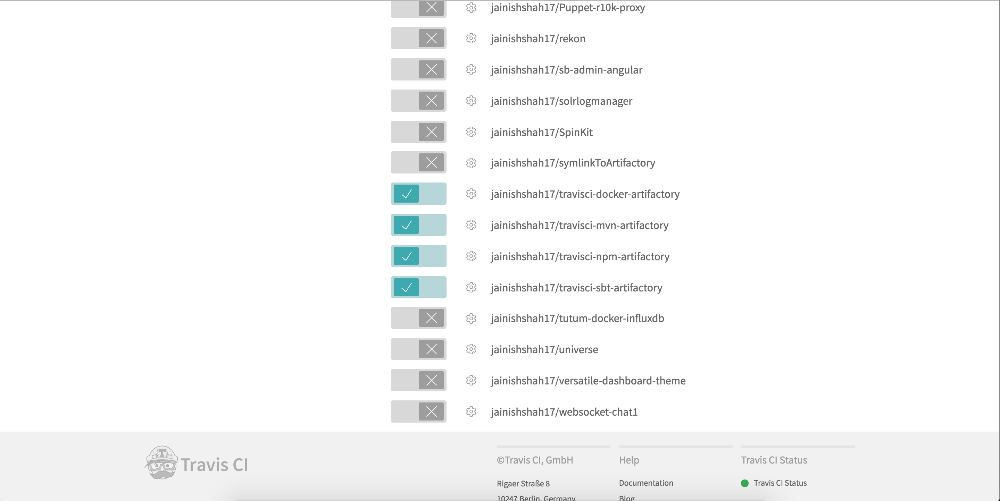
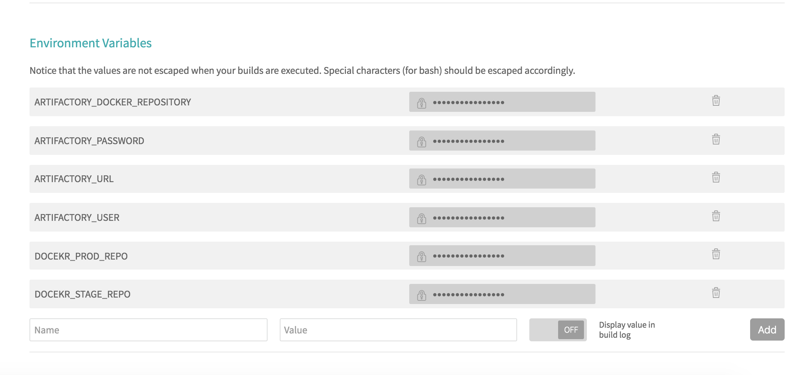
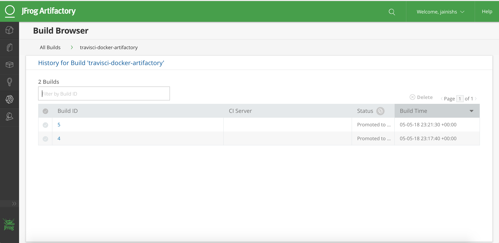

# travisci-docker-artifactory

`To make this integration work you will need to have running Artifactory-pro/Artifactory SAAS.`

### Steps to build docker images using Circle CI and push it to Artifactory.

##### Step 1:

copy `.travis.yml` to your project

##### Step 2:

Enable your project in [travis-ci](https://travis-ci.org/) .

##### Step 3:

add Environment Variables `ARTIFACTORY_USERNAME`, `ARTIFACTORY_EMAIL`, `ARTIFACTORY_DOCKER_REPOSITORY` and `ARTIFACTORY_PASSWORD` in build settings of travis-ci.

##### Step 4:

You should be able to see published Docker image in Artifactory.

## Note: `This solution only supports Artifactory with valid ssl as Travis CI does not support insecure registry`
